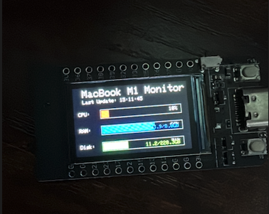

# ESP32 TTGO T-Display V1.1 Board Mac System Monitor

This program displays your MacBook M1 system resources on the TFT display of an **ESP32 TTGO T-Display V1.1 Board**. It monitors CPU, RAM, disk usage, and system load in real-time.

**Keywords:** ESP32, TTGO T-Display V1.1, Mac system monitor, TFT display, Arduino, system resources, CPU monitor, memory monitor, disk usage, MacBook M1, serial communication, JSON data

## Enhanced Display Features

**Compatible with:** ESP32 TTGO T-Display V1.1 Board with 240x320 TFT display

### ✅ **Optimized Formatting**
- **RAM**: 8.0/16.0GB (used/total)
- **Disk**: 150/500GB (used/total)
- **CPU**: 75% with red progress bar
- **Load**: 1m:1.23 5m:0.85 15m:0.67
- **Temp**: 65.0°C (if available)

### ✅ **Visual Improvements**
- Borders around progress bars for better visibility
- Optimized text positioning for better readability
- Consistent spacing between display elements
- Live timestamp of last update

## Hardware Requirements

- **ESP32 TTGO T-Display V1.1 Board** with integrated TFT display
- USB connection between Mac and ESP32 TTGO T-Display V1.1 Board
- TFT_eSPI Library for Arduino IDE

**Official Documentation:** For detailed specifications, pinouts, and driver information, visit the official [TTGO-T-Display repository](https://github.com/Xinyuan-LilyGO/TTGO-T-Display).

### ESP32 TTGO T-Display V1.1 Pinout


*Pin configuration and connections for the ESP32 TTGO T-Display V1.1 board*

## Software Setup

### 1. Set up Python environment

```bash
# Run the setup script
./setup.sh

# Or manually:
pip3 install -r requirements.txt
```

### 2. Upload ESP32 program

1. Open `esp32_system_monitor.cpp` in the Arduino IDE
2. Install the TFT_eSPI Library if not already present
3. Compile and upload the program to your ESP32 TTGO T-Display V1.1 Board

**Library Support:** For TFT_eSPI library setup and configuration specific to TTGO T-Display V1.1, visit the official [TTGO-T-Display repository](https://github.com/Xinyuan-LilyGO/TTGO-T-Display).

### 3. Start System Monitor

```bash
python3 mac_system_monitor.py
```

## How it Works

1. **Python script** on Mac reads system information
2. **Data transmission** via USB serial to ESP32 TTGO T-Display V1.1 Board
3. **TFT display** shows data in a clear format

## Display Layout



*Example of the final system monitor display showing CPU, RAM, disk usage and system load*

```
MacBook M1 Monitor     Last Update: 14:30:25
┌─────────────────────────────────────────┐
│ CPU:     [████████████░░░░] 75%         │
│ RAM:     [████████░░░░░░░░] 50%  8.0/16GB│
│ Disk:    [██████░░░░░░░░░░] 30% 150/500GB│
│ Load: 1m:1.2 5m:0.8 15m:0.6             │
│ Temp: 65°C                              │
└─────────────────────────────────────────┘
```

## Color Coding

- 🔴 **CPU**: Red - Shows high utilization
- 🔵 **RAM**: Blue - Memory consumption
- 🟢 **Disk**: Green - Disk usage
- 🟡 **Temp**: Yellow - CPU temperature
- 🔷 **Load**: Cyan - System load

## Configuration

### Customize Python Script

```python
# Change serial interface (Default: /dev/ttyUSB0)
serial_port = '/dev/ttyUSB0'  # On macOS: /dev/ttyUSB0, /dev/ttyACM0, etc.

# Change update interval (Default: 2 seconds)
time.sleep(2)  # In seconds

# Change baud rate (must match ESP32)
baud_rate = 115200
```

### Customize ESP32 Display

```cpp
// Change display rotation
tft.setRotation(1); // 0=Portrait, 1=Landscape, 2=Portrait 180°, 3=Landscape 180°

// Customize colors
#define CPU_COLOR TFT_RED
#define MEMORY_COLOR TFT_BLUE
#define DISK_COLOR TFT_GREEN
```

## Troubleshooting

### Problem: ESP32 TTGO T-Display V1.1 Board not recognized

```bash
# Show available serial interfaces
ls /dev/tty*

# Run script with different interface
python3 mac_system_monitor.py
# Then manually specify the correct port
```

**Driver Issues:** If you're having problems with USB drivers or board recognition, visit the official [TTGO-T-Display repository](https://github.com/Xinyuan-LilyGO/TTGO-T-Display) for driver downloads and troubleshooting guides.

### Problem: No data on TFT display

- ✅ ESP32 TTGO T-Display V1.1 Board program uploaded successfully?
- ✅ USB connection stable?
- ✅ Python script running without errors?
- ✅ Serial Monitor shows received data?

### Problem: Display only shows "Waiting for data"

- ✅ Python script started?
- ✅ Correct serial interface?
- ✅ ESP32 TTGO T-Display V1.1 Board connected via USB?

### Problem: Missing Python dependencies

```bash
# Reinstall dependencies
pip3 install --upgrade psutil pyserial
```

## Technical Details

- **Data format**: JSON over serial connection
- **Update rate**: 2 seconds (configurable)
- **Baud rate**: 115200 (standard)
- **Display**: 240x320 TFT with ILI9341 controller on ESP32 TTGO T-Display V1.1 Board
- **Python modules**: psutil, pyserial

## Advanced Features

### CPU Temperature (if supported)

The script automatically attempts to read CPU temperature information. If not available, this section will be hidden.

### System Load Optimization

Even under high system load, all values are displayed correctly. The Python script is designed to be resource-efficient.

## Performance

- **Mac CPU overhead**: < 1%
- **ESP32 RAM**: ~15KB
- **Network**: No network traffic
- **Update latency**: < 100ms

## Support

If you have problems:
1. Enable Serial Monitor in Arduino IDE for ESP32 TTGO T-Display V1.1 Board
2. Check Python script outputs
3. Test USB connection
4. Use Arduino IDE debug mode

**Additional Resources:** For hardware-specific issues, driver problems, or detailed specifications, visit the official [TTGO-T-Display repository](https://github.com/Xinyuan-LilyGO/TTGO-T-Display).

Have fun with your Mac System Monitor on ESP32 TTGO T-Display V1.1 Board! 🎉
