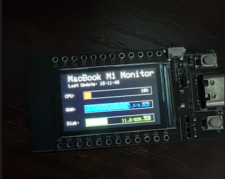

# ESP32 TTGO T-Display V1.1 Board Mac System Monitor

Dieses Programm zeigt die Systemressourcen deines MacBook M1 auf dem TFT-Bildschirm eines **ESP32 TTGO T-Display V1.1 Boards** an. Es überwacht CPU, RAM, Festplattennutzung und Systemlast in Echtzeit.

**Schlüsselwörter:** ESP32, TTGO T-Display V1.1, Mac System Monitor, TFT Display, Arduino, Systemressourcen, CPU Monitor, Speicher Monitor, Festplattennutzung, MacBook M1, serielle Kommunikation, JSON Daten

## Verbesserte Anzeige-Features

**Kompatibel mit:** ESP32 TTGO T-Display V1.1 Board mit 240x320 TFT Display

### ✅ **Optimierte Formatierung**
- **RAM**: 8.0/16.0GB (verwendet/gesamt)
- **Disk**: 150/500GB (verwendet/gesamt)
- **CPU**: 75% mit rotem Fortschrittsbalken
- **Load**: 1m:1.23 5m:0.85 15m:0.67
- **Temp**: 65.0°C (falls verfügbar)

### ✅ **Visuelle Verbesserungen**
- Rahmen um Fortschrittsbalken für bessere Sichtbarkeit
- Optimierte Textpositionierung für bessere Lesbarkeit
- Konsistente Abstände zwischen den Anzeige-Elementen
- Live-Uhrzeit der letzten Aktualisierung

## Hardware-Anforderungen

- **ESP32 TTGO T-Display V1.1 Board** mit integriertem TFT-Bildschirm
- USB-Verbindung zwischen Mac und ESP32 TTGO T-Display V1.1 Board
- TFT_eSPI Library für Arduino IDE

**Offizielle Dokumentation:** Für detaillierte Spezifikationen, Pinbelegungen und Treiber-Informationen, besuche das offizielle [TTGO-T-Display Repository](https://github.com/Xinyuan-LilyGO/TTGO-T-Display).

### ESP32 TTGO T-Display V1.1 Pinbelegung


*Pin-Konfiguration und Anschlüsse für das ESP32 TTGO T-Display V1.1 Board*

## Software-Setup

### 1. Python-Umgebung einrichten

```bash
# Führe das Setup-Script aus
./setup.sh

# Oder manuell:
pip3 install -r requirements.txt
```

### 2. ESP32-Programm hochladen

1. Öffne `esp32_system_monitor.cpp` in der Arduino IDE
2. Installiere die TFT_eSPI Library falls noch nicht vorhanden
3. Kompiliere und lade das Programm auf deinen ESP32 TTGO T-Display V1.1 Board hoch

**Library-Unterstützung:** Für TFT_eSPI Library-Setup und Konfiguration spezifisch für TTGO T-Display V1.1, besuche das offizielle [TTGO-T-Display Repository](https://github.com/Xinyuan-LilyGO/TTGO-T-Display).

### 3. System-Monitor starten

```bash
python3 mac_system_monitor.py
```

## Funktionsweise

1. **Python-Script** auf dem Mac liest Systeminformationen aus
2. **Datenübertragung** via USB-Serial an das ESP32 TTGO T-Display V1.1 Board
3. **TFT-Anzeige** zeigt die Daten in übersichtlicher Form an

## Anzeige-Layout



*Beispiel der fertigen System Monitor Anzeige mit CPU, RAM, Festplattennutzung und Systemlast*

```
MacBook M1 Monitor     Last Update: 14:30:25
┌─────────────────────────────────────────┐
│ CPU:     [████████████░░░░] 75%         │
│ RAM:     [████████░░░░░░░░] 50%  8.0/16GB│
│ Disk:    [██████░░░░░░░░░░] 30% 150/500GB│
│ Load: 1m:1.2 5m:0.8 15m:0.6             │
│ Temp: 65°C                              │
└─────────────────────────────────────────┘
```

## Farbkodierung

- 🔴 **CPU**: Rot - Hohe Auslastung anzeigen
- 🔵 **RAM**: Blau - Speicherverbrauch
- 🟢 **Disk**: Grün - Festplattennutzung
- 🟡 **Temp**: Gelb - CPU-Temperatur
- 🔷 **Load**: Cyan - Systemlast

## Konfiguration

### Python-Script anpassen

```python
# Serielle Schnittstelle ändern (Standard: /dev/ttyUSB0)
serial_port = '/dev/ttyUSB0'  # Auf macOS: /dev/ttyUSB0, /dev/ttyACM0, etc.

# Update-Intervall ändern (Standard: 2 Sekunden)
time.sleep(2)  # In Sekunden

# Baudrate ändern (muss mit ESP32 übereinstimmen)
baud_rate = 115200
```

### ESP32-Display anpassen

```cpp
// Display-Rotation ändern
tft.setRotation(1); // 0=Portrait, 1=Landscape, 2=Portrait 180°, 3=Landscape 180°

// Farben anpassen
#define CPU_COLOR TFT_RED
#define MEMORY_COLOR TFT_BLUE
#define DISK_COLOR TFT_GREEN
```

## Troubleshooting

### Problem: ESP32 TTGO T-Display V1.1 Board wird nicht erkannt

```bash
# Verfügbare serielle Schnittstellen anzeigen
ls /dev/tty*

# Script mit anderer Schnittstelle ausführen
python3 mac_system_monitor.py
# Dann manuell die richtige Port angeben
```

**Treiberprobleme:** Falls du Probleme mit USB-Treibern oder Board-Erkennung hast, besuche das offizielle [TTGO-T-Display Repository](https://github.com/Xinyuan-LilyGO/TTGO-T-Display) für Treiber-Downloads und Problemlösungsanleitungen.

### Problem: Keine Daten auf dem TFT-Display

- ✅ ESP32 TTGO T-Display V1.1 Board-Programm erfolgreich hochgeladen?
- ✅ USB-Verbindung stabil?
- ✅ Python-Script läuft ohne Fehler?
- ✅ Serial Monitor zeigt empfangene Daten?

### Problem: Display zeigt nur "Waiting for data"

- ✅ Python-Script gestartet?
- ✅ Richtige serielle Schnittstelle?
- ✅ ESP32 TTGO T-Display V1.1 Board über USB angeschlossen?

### Problem: Python-Abhängigkeiten fehlen

```bash
# Dependencies neu installieren
pip3 install --upgrade psutil pyserial
```

## Technische Details

- **Datenformat**: JSON über serielle Verbindung
- **Update-Rate**: 2 Sekunden (konfigurierbar)
- **Baudrate**: 115200 (Standard)
- **Display**: 240x320 TFT mit ILI9341 Controller auf ESP32 TTGO T-Display V1.1 Board
- **Python-Module**: psutil, pyserial

## Erweiterte Features

### CPU-Temperatur (falls unterstützt)

Das Script versucht automatisch, CPU-Temperatur-Informationen zu lesen. Falls nicht verfügbar, wird dieser Bereich ausgeblendet.

### Systemlast-Optimierung

Bei hoher Systemlast werden alle Werte weiterhin korrekt angezeigt. Das Python-Script ist ressourcensparend konzipiert.

## Performance

- **Mac CPU-Overhead**: < 1%
- **ESP32 RAM**: ~15KB
- **Netzwerk**: Kein Netzwerk-Traffic
- **Update-Latenz**: < 100ms

## Support

Falls du Probleme hast:
1. Serial Monitor in Arduino IDE für ESP32 TTGO T-Display V1.1 Board aktivieren
2. Python-Script-Ausgaben prüfen
3. USB-Verbindung testen
4. Arduino IDE Debug-Modus verwenden

**Zusätzliche Ressourcen:** Für Hardware-spezifische Probleme, Treiberprobleme oder detaillierte Spezifikationen, besuche das offizielle [TTGO-T-Display Repository](https://github.com/Xinyuan-LilyGO/TTGO-T-Display).

Viel Spaß mit deinem Mac System Monitor auf ESP32 TTGO T-Display V1.1 Board! 🎉
